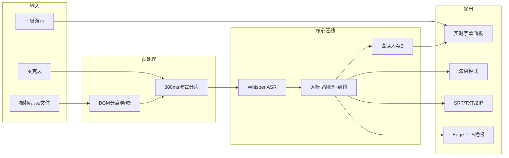

# AI 同声传译助手

七牛云暑期实训 · 第三批次题目二：**AI 同声传译助手**

基于 **Python 3.10 + Django 4.2** 的实时同声传译 Web 应用，支持 **Windows / macOS / Linux** 一键部署。

## 功能清单

| 功能 | 状态 |
|------|------|
| 麦克风实时收音同传 | ✅ |
| 本地音视频文件上传同传（MP4/MOV/AVI） | ✅ |
| 流式 Whisper ASR（300ms 低延迟分片） | ✅ |
| 大模型实时中文字幕 + AI 上下文纠错 | ✅ |
| Edge-TTS 中文语音播报 | ✅ |
| 视频 BGM 检测 + 人声分离（Spleeter 可选） | ✅ |
| 环境降噪（noisereduce） | ✅ |
| 双语字幕 / SRT / VTT / TXT / ZIP 导出 | ✅ |
| 同传历史记录保存与回看 | ✅ |
| 识别质量评分（质量分 / 信噪比 / 延迟） | ✅ |
| 一键演示模式（答辩样例字幕） | ✅ |
| 演讲模式（全屏悬浮大字幕） | ✅ |
| 术语表 / 热词优先翻译 | ✅ |
| 轻量说话人分段（发言人 A/B） | ✅ |
| 字幕样式自定义（字号 / 颜色 / 位置） | ✅ |
| 视频同传暂停 / 进度条 / 跳转 | ✅ |
| 系统状态监控页 `/status` | ✅ |
| 低延迟 / 高准确率双模式 | ✅ |
| 七牛云 Kodo 云端存储 | ✅（可选，需配置） |
| Docker Compose 一键部署 | ✅ |
| GitHub Actions CI 自动检查 | ✅ |
| 快捷键（D 演示 / P 演讲 / 空格暂停） | ✅ |

## 技术栈

| 组件 | 说明 |
|------|------|
| Django 4.2 | Web 框架 |
| faster-whisper | 流式 ASR |
| httpx | 大模型翻译（OpenAI 兼容 API） |
| edge-tts | 中文语音合成 |
| pydub + **ffmpeg** | 音视频解码（**三平台必装**） |
| Spleeter（可选） | 高质量人声/BGM 分离 |
| 七牛 SDK | 对象存储（可选） |

---

## 架构概览



---

## Docker 一键启动（可选）

```bash
cp .env.example .env   # 填入 LLM_API_KEY
docker compose up --build
```

浏览器访问 <http://127.0.0.1:8000/>。容器内已内置 **ffmpeg**，无需本机单独安装。

---

## 三平台部署指南

> 以下步骤**逻辑相同**，但各系统命令、路径、权限略有差异，请按你所用的系统操作。

### 0. 环境要求（通用）

| 项目 | 要求 |
|------|------|
| Python | **3.10 ~ 3.11** 推荐（3.9 可用，3.12+ 需自行验证） |
| ffmpeg | 必须安装并加入 **PATH** |
| 浏览器 | Chrome / Edge 推荐（文件同传、麦克风） |
| 磁盘 | 首次运行下载 Whisper 模型（`base` 约 150MB） |
| 网络 | Edge-TTS、LLM API 需可访问外网 |

```bash
git clone https://github.com/YANS311/ai-real-time-interpreter.git
cd ai-real-time-interpreter
```

---

### macOS 配置

#### 1) 安装系统依赖

```bash
# Homebrew（未安装请先：https://brew.sh）
brew install ffmpeg python@3.10
```

#### 2) 虚拟环境与依赖

```bash
python3.10 -m venv venv
source venv/bin/activate
pip install -U pip
pip install -r requirements.txt
```

#### 3) 可选：Spleeter 人声分离（效果更好，体积较大）

```bash
pip install -r requirements-spleeter.txt
```

> Apple Silicon (M1/M2) 若 TensorFlow 安装失败，可跳过此步，项目会自动使用**快速分离 + 降噪**链路。

#### 4) 环境变量

```bash
cp .env.example .env
# 用任意编辑器修改 .env，填入 LLM_API_KEY
```

#### 5) 启动

```bash
python manage.py runserver
```

打开 <http://127.0.0.1:8000/>。首次麦克风使用需在 **系统设置 → 隐私与安全性 → 麦克风** 中允许浏览器权限。

---

### Linux 配置（Ubuntu / Debian）

#### 1) 安装系统依赖

```bash
sudo apt update
sudo apt install -y ffmpeg python3.10 python3.10-venv python3-pip \
  build-essential libsndfile1
```

> Fedora / CentOS 请改用 `dnf install ffmpeg python3` 等等价包。

#### 2) 虚拟环境与依赖

```bash
python3.10 -m venv venv
source venv/bin/activate
pip install -U pip
pip install -r requirements.txt
```

#### 3) 可选：Spleeter

```bash
pip install -r requirements-spleeter.txt
```

> 无 GPU 时 Spleeter 较慢，视频较长请耐心等待预处理；或保持默认快速分离模式。

#### 4) 环境变量与启动

```bash
cp .env.example .env
nano .env          # 或 vim / code
python manage.py runserver 0.0.0.0:8000
```

服务器部署时请在 `.env` 中设置 `ALLOWED_HOSTS=你的域名或IP`。

#### 5) Linux 特有注意

- **麦克风**：浏览器仅在 `https://` 或 `localhost` 下可稳定调用麦克风；远程访问请配 HTTPS 或 SSH 隧道。
- **权限**：若 `pip install` 编译 scipy 失败，确认已安装 `build-essential`。

---

### Windows 配置

#### 1) 安装系统依赖

**Python 3.10：**

- 从 <https://www.python.org/downloads/> 安装，勾选 **「Add Python to PATH」**

**ffmpeg（任选一种）：**

```powershell
# 方式 A：Chocolatey（管理员 PowerShell）
choco install ffmpeg

# 方式 B：手动
# 1. 下载 https://www.gyan.dev/ffmpeg/builds/ ffmpeg-release-essentials.zip
# 2. 解压到 C:\ffmpeg
# 3. 将 C:\ffmpeg\bin 加入系统环境变量 PATH
```

验证：

```powershell
python --version
ffmpeg -version
```

#### 2) 虚拟环境与依赖

```powershell
cd ai-real-time-interpreter
python -m venv venv

# PowerShell
venv\Scripts\Activate.ps1
# 若报执行策略错误，先运行：
# Set-ExecutionPolicy -ExecutionPolicy RemoteSigned -Scope CurrentUser

pip install -U pip
pip install -r requirements.txt
```

#### 3) 可选：Spleeter

```powershell
pip install -r requirements-spleeter.txt
```

> Windows 上 TensorFlow 体积大，安装慢属正常；失败不影响主流程。

#### 4) 环境变量

```powershell
copy .env.example .env
notepad .env
```

#### 5) 启动

```powershell
python manage.py runserver
```

浏览器推荐 **Chrome / Edge**。文件同传在 Windows 上请用 Chrome 系浏览器（`captureStream` 支持更好）。

#### 6) Windows 特有注意

- 路径含中文一般无问题，但**项目路径避免空格**更稳妥。
- 防火墙首次运行可能弹窗，请允许 Python 访问专用网络。
- `pydub` 依赖 ffmpeg 在 PATH 中；安装后需**重开终端**再验证 `ffmpeg -version`。

---

## 环境变量说明（.env）

```bash
cp .env.example .env
```

| 变量 | 必填 | 说明 |
|------|------|------|
| `LLM_API_KEY` | **是** | 翻译与纠错；支持 OpenAI / DeepSeek / 七牛兼容接口 |
| `LLM_API_BASE` | 否 | API 地址，默认 OpenAI |
| `WHISPER_MODEL` | 否 | `tiny`/`base`/`small`，低配机用 `tiny` |
| `WHISPER_DEVICE` | 否 | `cpu` 或 `cuda`（需 NVIDIA + CUDA） |
| `AUDIO_CHUNK_DURATION_SEC` | 否 | 分片时长，默认 `0.3`（300ms） |
| `QINIU_*` | 否 | 七牛云存储四项，加分项 |

**有 NVIDIA GPU 时（三平台通用）：**

```env
WHISPER_DEVICE=cuda
WHISPER_COMPUTE_TYPE=float16
```

Windows 需额外安装对应版本 [CUDA Toolkit](https://developer.nvidia.com/cuda-downloads) 与 cuDNN。

---

## 启动与验证

```bash
# 激活虚拟环境后
python manage.py check
python manage.py runserver
```

访问 <http://127.0.0.1:8000/>，打开开发者工具网络面板，确认 `/api/health/` 返回：

```json
{
  "status": "ok",
  "llm_configured": true,
  "spleeter_available": false,
  "chunk_duration_ms": 300
}
```

- `llm_configured: false` → 检查 `.env` 中 `LLM_API_KEY`
- `spleeter_available: true` → 已启用 Spleeter 高质量人声分离

---

## Demo 演示流程（约 1 分钟 · 答辩推荐）

> 无需麦克风时：直接点 **「一键演示」** + **「演讲模式」** 投屏，稳定不翻车。

1. **一键演示**：点「一键演示」→ 自动播放 6 句双语样例字幕（可开 TTS）
2. **演讲模式**：点「演讲模式」→ 全屏大字幕，按 `Esc` 退出
3. **视频 + BGM**（可选）：上传 `.mp4` → 勾选 BGM 分离 → 用 **暂停/进度条** 控制识别节奏
4. **说话人 A/B**：勾选「说话人标注」，双人对话视频可看到发言人切换
5. **术语表**：输入 `Whisper=语音识别,GPT=生成式预训练模型` 观察翻译偏好
6. **质量面板**：顶栏查看质量分、信噪比、均延迟
7. **导出**：「导出 SRT」或「导出 ZIP」（含 JSON 时间轴）
8. **系统状态**：打开 [/status/](http://127.0.0.1:8000/status/) 展示监控面板

快速自测脚本：

```bash
chmod +x scripts/selftest.sh
./scripts/selftest.sh http://127.0.0.1:8000
```

---

## 项目结构

```
ai-real-time-interpreter/
├── manage.py
├── Dockerfile / docker-compose.yml
├── requirements.txt              # 基础依赖（三平台通用）
├── requirements-spleeter.txt     # 可选：Spleeter + TensorFlow
├── .env.example
├── scripts/create-pr.sh          # 自动创建 PR
├── scripts/selftest.sh           # 本地快速自测
├── .github/workflows/auto-pr.yml
├── core/                         # Django 配置
└── interpreter/
    ├── views.py                  # API 接口
    ├── templates/
    │   ├── index.html            # 主页面
    │   └── status.html           # 状态监控页
    ├── static/demo/              # 演示字幕脚本
    └── utils/
        ├── asr.py                # Whisper 识别
        ├── translate.py          # 翻译 + 纠错 + 术语表
        ├── speaker.py            # 说话人 A/B 分段
        ├── audio_process.py      # Spleeter + 降噪
        ├── bgm.py                # BGM 检测与预处理
        ├── export.py             # SRT/TXT 导出
        ├── export_bundle.py      # ZIP 打包导出
        ├── demo.py               # 演示模式
        ├── glossary.py           # 术语表
        ├── history_store.py      # 历史记录
        ├── quality.py            # 质量评分
        ├── tts.py                # Edge-TTS
        ├── stream.py             # 音频流缓冲 + 进度控制
        ├── pipeline.py           # 处理管线
        └── qiniu_storage.py      # 七牛 Kodo（可选）
```

---

## API 一览

| 路径 | 方法 | 说明 |
|------|------|------|
| `/` | GET | 主页面 |
| `/status/` | GET | 系统状态监控页 |
| `/api/health/` | GET | 健康检查（精简） |
| `/api/status/` | GET | 系统状态 JSON |
| `/api/audio/chunk/` | POST | 音频分片 / 拉取预处理流 |
| `/api/video/ingest/` | POST | 视频预处理（BGM 分离） |
| `/api/demo/script/` | GET | 演示模式预置字幕 |
| `/api/session/progress/` | GET | 视频同传播放进度 |
| `/api/session/control/` | POST | 暂停 / 继续 / 跳转 / 停止 |
| `/api/history/` | GET | 历史记录列表 |
| `/api/history/save/` | POST | 保存当前会话 |
| `/api/upload/` | POST | 上传七牛云（可选） |
| `/api/export/subtitles/` | GET/POST | 导出 SRT/VTT/TXT |
| `/api/export/bundle/` | GET/POST | 导出 ZIP 字幕包 |
| `/api/tts/` | POST | 中文 TTS |

---

## Git 与 PR

提交规范见 [CONTRIBUTING.md](CONTRIBUTING.md)。

```bash
# 自动创建 PR（需 gh CLI）
./scripts/create-pr.sh
```

---

## 常见问题（按系统）

| 现象 | macOS | Linux | Windows |
|------|-------|-------|---------|
| 音频解码失败 | `brew install ffmpeg` | `apt install ffmpeg` | PATH 加入 `ffmpeg\bin` |
| 麦克风无权限 | 系统设置 → 隐私 → 麦克风 | 浏览器需 HTTPS/localhost | 设置 → 隐私 → 麦克风 |
| `[待翻译]` | 配置 `.env` 中 `LLM_API_KEY` | 同左 | 同左 |
| Whisper 很慢 | `WHISPER_MODEL=tiny` | 同左；有 GPU 用 `cuda` | 同左 |
| Spleeter 不可用 | 可跳过，自动降级 | 同左 | TensorFlow 安装慢，可跳过 |
| 文件同传无响应 | 换 Chrome | 换 Chrome | **必须用 Chrome/Edge** |
| TTS 无声 | 检查网络 / 系统音量 | 同左 | 检查防火墙 |

---

## 仓库权限（赛事要求）

| 时间 | 要求 |
|------|------|
| 6.7 23:59 前 | 仓库保持 **私有** |
| 6.8 00:00 起 | 改为 **公开** |
| 6.7 23:59 后 | 停止一切 push |

---

## License

MIT
